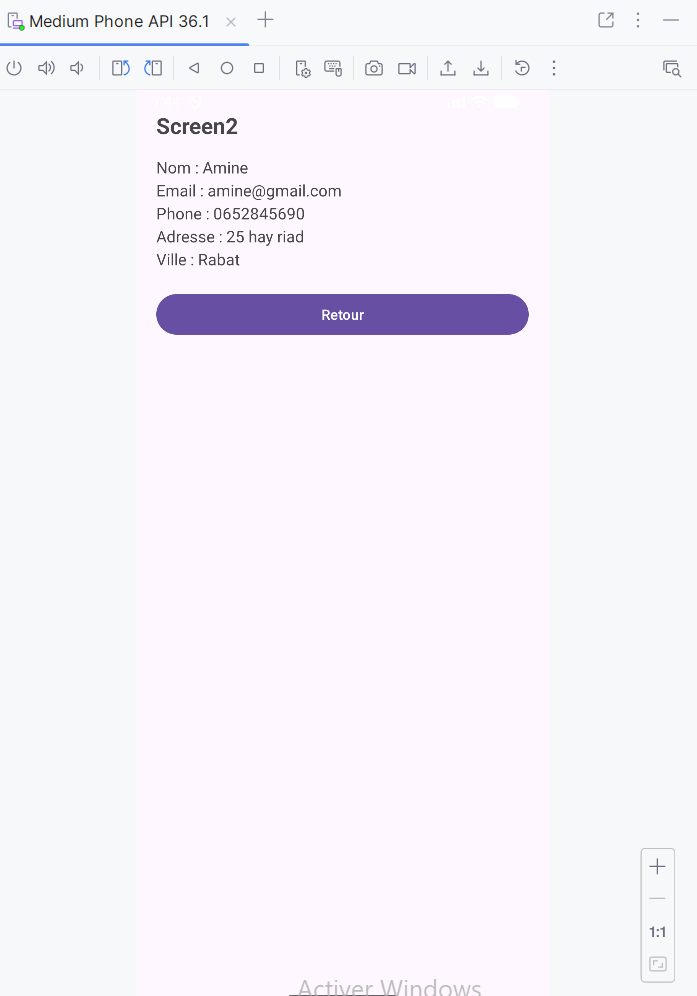

# LAB 3 — Formulaire Android (Java)

## Objectif
Ce laboratoire consiste à créer une application Android avec :
- Un **formulaire** de saisie (Nom, Email, Téléphone, Adresse, Ville)
- Un second écran qui affiche un **récapitulatif** des données envoyées
  ##  Fonctionnement

1. L’utilisateur remplit les champs du formulaire.
2. Il clique sur **Envoyer**.
3. Les données sont transmises à `MainActivity2`.
4. L’écran de récapitulatif affiche les données reçues.
5. Le bouton **Retour** ramène à l’écran formulaire.
   ## Technologies
- Android Studio
- Java
  ### 📝 Écran Formulaire

### 📋 Écran Récapitulatif

